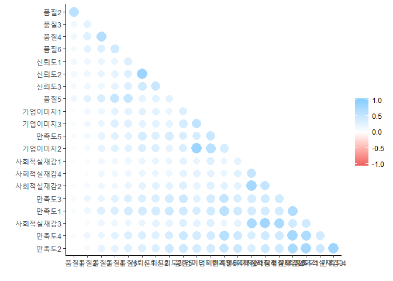
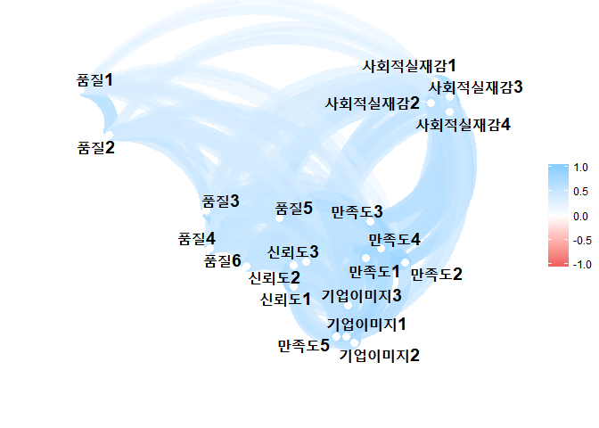
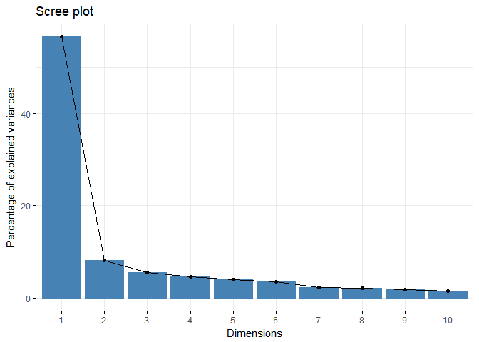
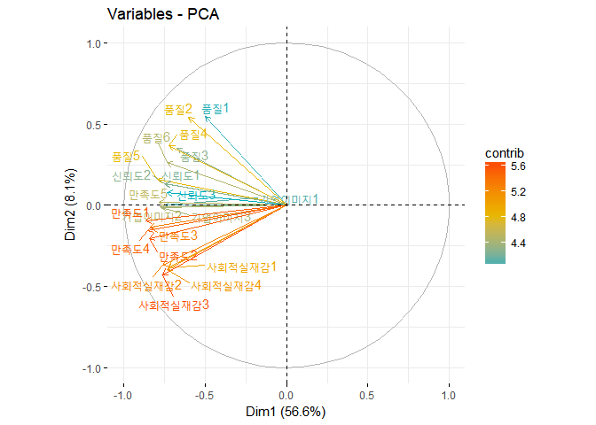
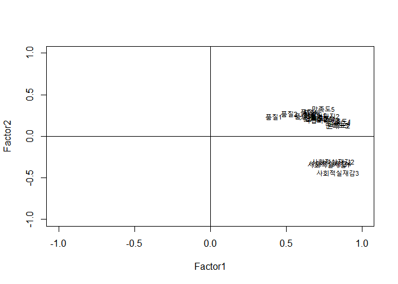
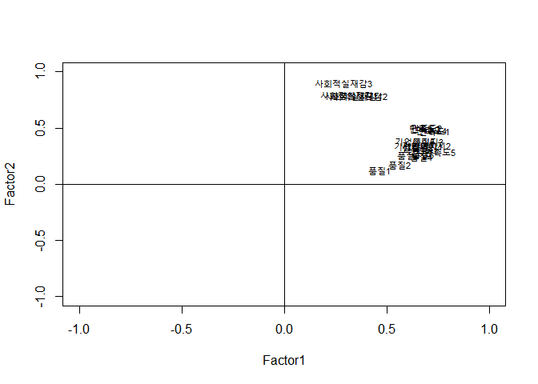

인터넷 뱅킹 고객의 '충성도'에 미치는 변인 Factor analysis
================

Settings
--------

-   Survey Data.
-   Each of the X variables have 1-5 scale scores about loyalty.
-   Y is loyalty(1-5)

Data Glimpse
------------

``` r
library(dplyr)
```

    ## 
    ## Attaching package: 'dplyr'

    ## The following objects are masked from 'package:stats':
    ## 
    ##     filter, lag

    ## The following objects are masked from 'package:base':
    ## 
    ##     intersect, setdiff, setequal, union

``` r
survey <- read.csv("C://Users//user//Desktop//github//Rproject//newRproject//survey_dt.csv")
glimpse(survey)
```

    ## Observations: 305
    ## Variables: 34
    ## $ 성별          <int> 2, 1, 1, 2, 2, 2, 2, 1, 1, 1, 1, 1, 1, 2, 1, 1, 1,...
    ## $ 연령          <int> 2, 2, 1, 2, 2, 2, 2, 3, 1, 4, 2, 4, 4, 1, 3, 3, 2,...
    ## $ 직업          <int> 1, 2, 4, 1, 1, 1, 1, 1, 1, 1, 1, 1, 1, 1, 1, 1, 1,...
    ## $ 학력          <int> 2, 1, 2, 2, 1, 1, 1, 1, 1, 2, 2, 1, 1, 1, 2, 1, 2,...
    ## $ 유형          <int> 2, 1, 1, 1, 2, 2, 2, 2, 2, 2, 2, 2, 2, 1, 2, 2, 2,...
    ## $ 거래기간      <int> 5, 5, 2, 5, 5, 5, 5, 5, 5, 5, 2, 5, 3, 2, 5, 5, 5, 5...
    ## $ 뱅킹이용이간  <int> 5, 5, 1, 3, 5, 5, 5, 2, 5, 5, 2, 5, 3, 2, 3, 3, 3, 3, ...
    ## $ 뱅킹갯수      <int> 4, 3, 4, 2, 4, 2, 1, 3, 3, 1, 4, 2, 3, 1, 1, 3, 3, 3...
    ## $ 품질1         <int> 5, 5, 5, 5, 4, 3, 1, 5, 3, 5, 1, 4, 3, 5, 3, 4, 4,...
    ## $ 품질2         <int> 5, 4, 5, 4, 4, 3, 2, 5, 3, 5, 1, 3, 3, 5, 3, 3, 4,...
    ## $ 품질3         <int> 4, 3, 4, 3, 3, 1, 2, 5, 3, 5, 1, 3, 3, 5, 2, 4, 4,...
    ## $ 품질4         <int> 4, 3, 4, 2, 3, 2, 3, 4, 3, 5, 1, 3, 4, 5, 2, 4, 4,...
    ## $ 품질5         <int> 5, 3, 3, 2, 3, 1, 1, 4, 3, 5, 1, 4, 2, 5, 4, 2, 4,...
    ## $ 품질6         <int> 4, 3, 4, 4, 4, 2, 2, 4, 3, 5, 1, 3, 4, 5, 2, 4, 4,...
    ## $ 기업이미지1   <int> 4, 3, 3, 2, 3, 1, 1, 4, 2, 5, 1, 4, 2, 5, 3, 3, 4, 3,...
    ## $ 기업이미지2   <int> 4, 3, 3, 3, 3, 1, 2, 4, 2, 5, 1, 4, 2, 5, 3, 3, 4, 3,...
    ## $ 기업이미지3   <int> 4, 4, 3, 2, 3, 1, 1, 3, 3, 5, 3, 4, 3, 5, 2, 4, 4, 3,...
    ## $ 사회적실재감1 <int> 3, 3, 2, 1, 2, 2, 2, 3, 2, 5, 1, 4, 4, 5, 3, 4, 4, 3, ...
    ## $ 사회적실재감2 <int> 3, 3, 3, 3, 2, 2, 1, 3, 1, 5, 1, 3, 2, 5, 4, 2, 3, 2, ...
    ## $ 사회적실재감3 <int> 4, 3, 2, 2, 2, 3, 2, 3, 1, 5, 1, 3, 2, 5, 3, 2, 3, 2, ...
    ## $ 사회적실재감4 <int> 4, 2, 1, 3, 2, 3, 2, 3, 1, 5, 1, 3, 2, 5, 3, 2, 3, 2, ...
    ## $ 신뢰도1       <int> 4, 4, 4, 4, 4, 1, 2, 3, 3, 5, 1, 4, 4, 5, 3, 4, 4, ...
    ## $ 신뢰도2       <int> 4, 4, 4, 4, 4, 2, 1, 3, 3, 5, 1, 4, 2, 5, 3, 4, 4, ...
    ## $ 신뢰도3       <int> 4, 4, 4, 3, 4, 2, 3, 3, 2, 5, 1, 4, 2, 5, 3, 3, 3, ...
    ## $ 만족도1       <int> 4, 3, 3, 4, 3, 1, 1, 3, 2, 5, 1, 4, 3, 5, 2, 3, 4, ...
    ## $ 만족도2       <int> 4, 3, 2, 4, 3, 1, 1, 3, 2, 5, 1, 4, 1, 5, 4, 3, 3, ...
    ## $ 만족도3       <int> 4, 3, 3, 3, 3, 2, 1, 3, 2, 5, 1, 4, 3, 5, 3, 3, 4, ...
    ## $ 만족도4       <int> 3, 3, 3, 3, 3, 1, 1, 3, 2, 5, 1, 4, 2, 5, 3, 2, 4, ...
    ## $ 만족도5       <int> 4, 4, 3, 4, 4, 1, 2, 3, 3, 5, 1, 5, 3, 5, 3, 4, 4, ...
    ## $ 충성도1       <int> 4, 4, 2, 2, 3, 1, 1, 3, 2, 5, 1, 4, 5, 5, 3, 2, 5, ...
    ## $ 충성도2       <int> 4, 5, 3, 4, 4, 1, 1, 3, 3, 5, 2, 5, 3, 5, 3, 4, 4, ...
    ## $ 충성도3       <int> 4, 4, 2, 4, 4, 1, 1, 3, 3, 5, 1, 4, 2, 5, 4, 4, 5, ...
    ## $ 충성도4       <int> 3, 4, 2, 4, 2, 1, 1, 3, 2, 5, 1, 3, 4, 5, 4, 2, 5, ...
    ## $ 충성도5       <int> 4, 3, 1, 4, 4, 1, 1, 3, 2, 5, 1, 3, 2, 5, 4, 3, 5, ...

> 305 observations, with 34 variables.

> '성별', '직업', '유형' : Nominal Variables

``` r
library(corrr)
```

    ## Warning: package 'corrr' was built under R version 3.4.4

``` r
survey_plot <- survey %>%
  select(-충성도1,-충성도2,-충성도3,-충성도4,-충성도5,
         -연령,-학력,-거래기간,-뱅킹이용이간,-뱅킹갯수,-성별,-직업,-유형) %>%
  correlate() %>%
  rearrange() %>%
  shave()
```

    ## 
    ## Correlation method: 'pearson'
    ## Missing treated using: 'pairwise.complete.obs'

``` r
fashion(survey_plot)
```

    ##          rowname 품질1 품질2 품질3 품질4 품질6 신뢰도1 신뢰도2 신뢰도3
    ## 1          품질1                                                      
    ## 2          품질2   .74                                                
    ## 3          품질3   .42   .52                                          
    ## 4          품질4   .42   .54   .77                                    
    ## 5          품질6   .38   .52   .56   .63                              
    ## 6        신뢰도1   .40   .43   .46   .47   .56                        
    ## 7        신뢰도2   .40   .45   .48   .49   .56     .86                
    ## 8        신뢰도3   .38   .41   .44   .49   .55     .63     .67        
    ## 9          품질5   .43   .53   .59   .68   .68     .49     .51     .52
    ## 10   기업이미지1   .30   .41   .44   .50   .51     .53     .53     .47
    ## 11   기업이미지3   .33   .41   .46   .55   .54     .51     .52     .49
    ## 12       만족도5   .34   .39   .48   .53   .52     .60     .55     .60
    ## 13   기업이미지2   .29   .39   .49   .53   .53     .58     .57     .49
    ## 14 사회적실재감1   .29   .34   .41   .41   .44     .46     .48     .46
    ## 15 사회적실재감4   .27   .30   .42   .41   .43     .46     .47     .44
    ## 16 사회적실재감2   .30   .36   .41   .42   .46     .50     .52     .51
    ## 17       만족도3   .34   .46   .48   .53   .57     .57     .56     .61
    ## 18       만족도1   .33   .44   .55   .57   .60     .62     .61     .65
    ## 19 사회적실재감3   .25   .34   .43   .44   .45     .47     .50     .49
    ## 20       만족도4   .34   .43   .47   .52   .56     .58     .54     .59
    ## 21       만족도2   .28   .38   .49   .51   .54     .56     .57     .64
    ##    품질5 기업이미지1 기업이미지3 만족도5 기업이미지2 사회적실재감1
    ## 1                                                                 
    ## 2                                                                 
    ## 3                                                                 
    ## 4                                                                 
    ## 5                                                                 
    ## 6                                                                 
    ## 7                                                                 
    ## 8                                                                 
    ## 9                                                                 
    ## 10   .56                                                          
    ## 11   .60         .72                                              
    ## 12   .59         .59         .66                                  
    ## 13   .58         .86         .74     .60                          
    ## 14   .51         .47         .54     .46         .50              
    ## 15   .51         .51         .50     .46         .53           .68
    ## 16   .55         .48         .54     .53         .51           .82
    ## 17   .65         .53         .61     .69         .58           .60
    ## 18   .63         .59         .63     .74         .63           .60
    ## 19   .55         .51         .54     .47         .50           .80
    ## 20   .66         .60         .61     .75         .64           .59
    ## 21   .65         .60         .60     .68         .64           .57
    ##    사회적실재감4 사회적실재감2 만족도3 만족도1 사회적실재감3 만족도4
    ## 1                                                                   
    ## 2                                                                   
    ## 3                                                                   
    ## 4                                                                   
    ## 5                                                                   
    ## 6                                                                   
    ## 7                                                                   
    ## 8                                                                   
    ## 9                                                                   
    ## 10                                                                  
    ## 11                                                                  
    ## 12                                                                  
    ## 13                                                                  
    ## 14                                                                  
    ## 15                                                                  
    ## 16           .69                                                    
    ## 17           .63           .63                                      
    ## 18           .61           .61     .78                              
    ## 19           .83           .81     .63     .63                      
    ## 20           .63           .63     .82     .79           .62        
    ## 21           .66           .63     .80     .82           .64     .85
    ##    만족도2
    ## 1         
    ## 2         
    ## 3         
    ## 4         
    ## 5         
    ## 6         
    ## 7         
    ## 8         
    ## 9         
    ## 10        
    ## 11        
    ## 12        
    ## 13        
    ## 14        
    ## 15        
    ## 16        
    ## 17        
    ## 18        
    ## 19        
    ## 20        
    ## 21

``` r
rplot(survey_plot)
```



Correlation is really high. Let's draw a network plot

``` r
survey_new <- survey %>%
  select(-충성도1,-충성도2,-충성도3,-충성도4,-충성도5,-연령,-학력,-거래기간,-뱅킹이용이간,-뱅킹갯수,-성별,-직업,-유형)
survey_new %>%
  correlate() %>%
  network_plot(min_cor = 0.2)
```

    ## 
    ## Correlation method: 'pearson'
    ## Missing treated using: 'pairwise.complete.obs'



**Variable selection is needed.**

PCA
---

#### Scree plot을 그려보자.

``` r
library(factoextra)
```

    ## Warning: package 'factoextra' was built under R version 3.4.4

    ## Loading required package: ggplot2

    ## Welcome! Related Books: `Practical Guide To Cluster Analysis in R` at https://goo.gl/13EFCZ

``` r
pca.result <- prcomp(survey_new, scale=T)
pca.result
```

    ## Standard deviations (1, .., p=21):
    ##  [1] 3.4487773 1.3040313 1.0802828 0.9899675 0.9162221 0.8629077 0.6979576
    ##  [8] 0.6678685 0.6149989 0.5622503 0.5499475 0.5188904 0.4853494 0.4692003
    ## [15] 0.4467172 0.4260898 0.3941778 0.3721322 0.3636500 0.3326974 0.3185560
    ## 
    ## Rotation (n x k) = (21 x 21):
    ##                      PC1           PC2         PC3          PC4
    ## 품질1         -0.1442322  0.4202597494 -0.36830276  0.127091858
    ## 품질2         -0.1742453  0.4160040600 -0.31579941 -0.002862019
    ## 품질3         -0.1959365  0.2695703316 -0.13128408 -0.235412836
    ## 품질4         -0.2086327  0.2810206268 -0.06447966 -0.284979371
    ## 품질5         -0.2297204  0.1225132606 -0.05489749 -0.222125854
    ## 품질6         -0.2125990  0.2006213138  0.01594775 -0.047413927
    ## 기업이미지1   -0.2165205  0.0008124599  0.29942318 -0.271239207
    ## 기업이미지2   -0.2257706 -0.0082586298  0.31379715 -0.237290553
    ## 기업이미지3   -0.2238277 -0.0087089632  0.21447664 -0.253655084
    ## 사회적실재감1 -0.2115529 -0.2932749942 -0.32739133 -0.019784590
    ## 사회적실재감2 -0.2208423 -0.2828147448 -0.28940462  0.047299999
    ## 사회적실재감3 -0.2211136 -0.3262135403 -0.31854143 -0.034597640
    ## 사회적실재감4 -0.2127044 -0.3046467687 -0.24362678 -0.052526153
    ## 신뢰도1       -0.2159751  0.1030536515  0.15168544  0.466879951
    ## 신뢰도2       -0.2174111  0.1007035172  0.10442755  0.461053181
    ## 신뢰도3       -0.2127656  0.0596298666  0.09153550  0.393314706
    ## 만족도1       -0.2501275 -0.0725283068  0.10753432  0.063066303
    ## 만족도2       -0.2445691 -0.1550323966  0.12569425  0.023248249
    ## 만족도3       -0.2432626 -0.1013288183  0.03356721  0.055658322
    ## 만족도4       -0.2468683 -0.1184254440  0.10835883  0.002864619
    ## 만족도5       -0.2272750  0.0124365768  0.26749453  0.044143433
    ##                       PC5         PC6          PC7           PC8
    ## 품질1         -0.18082515  0.44424218 -0.115393964  0.0060951031
    ## 품질2         -0.08689025  0.32535498  0.059309151 -0.0890489956
    ## 품질3          0.15970247 -0.40901776 -0.489468995  0.0003173099
    ## 품질4          0.17345347 -0.35200457 -0.166143176  0.0932526217
    ## 품질5          0.16651351 -0.04884470  0.394630436 -0.0556522207
    ## 품질6          0.10439389 -0.25945062  0.680659910 -0.0910151633
    ## 기업이미지1   -0.41559332  0.10090174 -0.003087954 -0.1536797272
    ## 기업이미지2   -0.36339725  0.04120052 -0.055751884 -0.1686021170
    ## 기업이미지3   -0.24764493  0.11075298  0.052853916  0.4069045370
    ## 사회적실재감1 -0.16047760 -0.06921585  0.063541154  0.3372618035
    ## 사회적실재감2 -0.10703062 -0.03964405  0.081278246  0.3149894914
    ## 사회적실재감3 -0.10068827 -0.10704062 -0.020956794 -0.0734761353
    ## 사회적실재감4 -0.07285033 -0.03270170 -0.144847747 -0.4548047979
    ## 신뢰도1       -0.21411889 -0.20240374 -0.056989835 -0.1055520869
    ## 신뢰도2       -0.23968378 -0.26784548 -0.040114847 -0.0933614050
    ## 신뢰도3        0.12124660 -0.06534468  0.052096993  0.2076572935
    ## 만족도1        0.23997144  0.06935772 -0.111556328 -0.0201844294
    ## 만족도2        0.27433049  0.15272378 -0.059336233 -0.2431018791
    ## 만족도3        0.29776212  0.20878378  0.032504255 -0.0911393720
    ## 만족도4        0.26591317  0.25996888 -0.027917231 -0.1285382969
    ## 만족도5        0.19122675  0.19122620 -0.183315136  0.4264000458
    ##                         PC9        PC10         PC11         PC12
    ## 품질1         -0.0532250746  0.23438337 -0.104353323  0.259954253
    ## 품질2          0.0295478359 -0.33328320  0.045319984 -0.288034571
    ## 품질3          0.0009581171 -0.19557543 -0.023590207  0.130074762
    ## 품질4         -0.0441684910  0.14568075  0.069771572 -0.186178817
    ## 품질5          0.0888878412  0.46971758  0.519737957  0.094222702
    ## 품질6          0.0509739429 -0.21067507 -0.473944835  0.204752559
    ## 기업이미지1   -0.1881050018 -0.13002508  0.099990314  0.198219401
    ## 기업이미지2   -0.0871887451 -0.16064470  0.127057852  0.114817127
    ## 기업이미지3    0.0150637522  0.24304225 -0.282025179 -0.510647032
    ## 사회적실재감1  0.0523437605 -0.29938640  0.094752577  0.024021530
    ## 사회적실재감2  0.0836878301 -0.12669761  0.243681296  0.207884047
    ## 사회적실재감3 -0.0777851375  0.13646364 -0.094291318 -0.101305228
    ## 사회적실재감4 -0.0563854033  0.35722822 -0.397841727  0.062351224
    ## 신뢰도1        0.3664616913  0.03262424  0.020285969  0.020552140
    ## 신뢰도2        0.1511026377  0.09312855  0.151717418 -0.212658914
    ## 신뢰도3       -0.8022973051  0.06958972  0.022230135  0.030545055
    ## 만족도1       -0.0054716928 -0.28483469 -0.167849470 -0.002162554
    ## 만족도2       -0.1170571734 -0.06196868  0.177663720 -0.037131606
    ## 만족도3        0.1062157505 -0.07584032  0.006313744 -0.418289692
    ## 만족도4        0.1609972934 -0.08287291  0.114112435  0.102847359
    ## 만족도5        0.2644160044  0.20886199 -0.221246369  0.377349090
    ##                      PC13        PC14         PC15        PC16
    ## 품질1         -0.41844964  0.14212483 -0.132918540  0.05264557
    ## 품질2          0.48596220 -0.21722737  0.106763018  0.02180928
    ## 품질3         -0.19762530 -0.17402472  0.466794894 -0.15122392
    ## 품질4          0.18786970  0.41851189 -0.499364023  0.26573139
    ## 품질5         -0.05397539 -0.28830117  0.008456192 -0.28552123
    ## 품질6         -0.07742668  0.07843189  0.080924138  0.11339996
    ## 기업이미지1    0.23127875  0.00379363 -0.098558113 -0.11994886
    ## 기업이미지2   -0.12544255  0.19816485  0.043617395 -0.04885151
    ## 기업이미지3   -0.24281437 -0.17979826  0.174127426  0.17061429
    ## 사회적실재감1 -0.27061387  0.09987074 -0.228473120 -0.30597987
    ## 사회적실재감2  0.13658919  0.08156947  0.224132642  0.39860099
    ## 사회적실재감3  0.22300278 -0.16018233 -0.059155566 -0.02866014
    ## 사회적실재감4  0.11396751  0.03274553  0.060190762 -0.04397454
    ## 신뢰도1       -0.01505335  0.06237114 -0.029376212 -0.10639410
    ## 신뢰도2       -0.01731343 -0.10532669 -0.012464671  0.14062361
    ## 신뢰도3        0.08453097  0.06656974  0.111659812 -0.11499740
    ## 만족도1       -0.12411131 -0.46235631 -0.535321776 -0.11322182
    ## 만족도2       -0.24079450 -0.19388783  0.048531733  0.46908609
    ## 만족도3       -0.03651094  0.43634323  0.190388204 -0.42066272
    ## 만족도4       -0.02777858  0.24424478  0.074278131  0.20806966
    ## 만족도5        0.37353401 -0.04588241  0.037175995 -0.10155716
    ##                       PC17        PC18         PC19        PC20
    ## 품질1         -0.131741347  0.13606627  0.089323389  0.08033244
    ## 품질2          0.136486838 -0.18210800 -0.139436897 -0.09235313
    ## 품질3          0.025238960  0.09803174  0.064432380  0.04030935
    ## 품질4         -0.005490359 -0.03118059 -0.003713394 -0.08650555
    ## 품질5          0.005576162 -0.10544125  0.007457341 -0.01019736
    ## 품질6         -0.027626503  0.09227879 -0.039106983  0.03897044
    ## 기업이미지1   -0.041258701  0.54035271  0.163033138 -0.19153123
    ## 기업이미지2   -0.121138595 -0.53937495 -0.171952591  0.27010605
    ## 기업이미지3    0.113926449 -0.04618523  0.123696098 -0.04409638
    ## 사회적실재감1  0.322096563  0.06200655 -0.370975539 -0.19243071
    ## 사회적실재감2 -0.433871490 -0.14291840  0.231338838 -0.04615546
    ## 사회적실재감3  0.119480449  0.22028157  0.286323463  0.38553447
    ## 사회적실재감4 -0.013082405 -0.22845114 -0.219846834 -0.21053692
    ## 신뢰도1        0.220529845 -0.18866796  0.433268408 -0.39452389
    ## 신뢰도2       -0.157770285  0.26353928 -0.438082722  0.36109895
    ## 신뢰도3        0.123718273 -0.12434163  0.044975046 -0.01173700
    ## 만족도1       -0.261953478 -0.18194713  0.199289132  0.13876887
    ## 만족도2        0.006717164  0.16056610 -0.208653548 -0.41470270
    ## 만족도3       -0.391483758  0.16286809  0.065933439 -0.02803318
    ## 만족도4        0.560986421  0.01667532  0.145054724  0.38995384
    ## 만족도5       -0.036048537  0.04339845 -0.289179212 -0.01772165
    ##                       PC21
    ## 품질1         -0.071436879
    ## 품질2         -0.005948409
    ## 품질3          0.045264679
    ## 품질4         -0.014402291
    ## 품질5          0.066693623
    ## 품질6         -0.069605566
    ## 기업이미지1    0.217336711
    ## 기업이미지2   -0.314228855
    ## 기업이미지3    0.121888062
    ## 사회적실재감1  0.011465002
    ## 사회적실재감2  0.204943020
    ## 사회적실재감3 -0.545564644
    ## 사회적실재감4  0.328687154
    ## 신뢰도1       -0.143019527
    ## 신뢰도2        0.178541059
    ## 신뢰도3        0.056087356
    ## 만족도1        0.206843278
    ## 만족도2       -0.358903691
    ## 만족도3       -0.053138937
    ## 만족도4        0.322448696
    ## 만족도5       -0.201992746

``` r
fviz_eig(pca.result)
```



**Scree plot**에서, 설명력이 급격하게 감소하는 지점에서 **latent factor**의 개수를 정하자. 2개로 정했다.

fviz\_pca\_var 함수 이용

Positive correlated variables point to the same side.

``` r
fviz_pca_var(pca.result,
             col.var = "contrib", # Color by contributions to the PC
             gradient.cols = c("#00AFBB", "#E7B800", "#FC4E07"),
             repel = TRUE     # Avoid text overlapping
)
```



먼저 varimax rotation을 하지 않은 Factor Analysis.
--------------------------------------------------

r의 기본 내장함수인 factanal 함수가 있다.

``` r
fa1 <- factanal(survey_new, factor=2, rotation="none")
print(fa1, sort=T, cutoff=0)
```

    ## 
    ## Call:
    ## factanal(x = survey_new, factors = 2, rotation = "none")
    ## 
    ## Uniquenesses:
    ##         품질1         품질2         품질3         품질4         품질5 
    ##         0.768         0.654         0.567         0.492         0.395 
    ##         품질6   기업이미지1   기업이미지2   기업이미지3 사회적실재감1 
    ##         0.469         0.459         0.405         0.423         0.272 
    ## 사회적실재감2 사회적실재감3 사회적실재감4       신뢰도1       신뢰도2 
    ##         0.253         0.099         0.268         0.459         0.467 
    ##       신뢰도3       만족도1       만족도2       만족도3       만족도4 
    ##         0.471         0.242         0.269         0.286         0.257 
    ##       만족도5 
    ##         0.341 
    ## 
    ## Loadings:
    ##               Factor1 Factor2
    ## 품질2          0.522   0.271 
    ## 품질3          0.612   0.242 
    ## 품질4          0.649   0.294 
    ## 품질5          0.749   0.209 
    ## 품질6          0.670   0.287 
    ## 기업이미지1    0.703   0.216 
    ## 기업이미지2    0.732   0.242 
    ## 기업이미지3    0.734   0.193 
    ## 사회적실재감1  0.782  -0.342 
    ## 사회적실재감2  0.810  -0.300 
    ## 사회적실재감3  0.842  -0.438 
    ## 사회적실재감4  0.792  -0.324 
    ## 신뢰도1        0.689   0.258 
    ## 신뢰도2        0.697   0.217 
    ## 신뢰도3        0.692   0.224 
    ## 만족도1        0.851   0.182 
    ## 만족도2        0.845   0.129 
    ## 만족도3        0.834   0.132 
    ## 만족도4        0.847   0.162 
    ## 만족도5        0.742   0.329 
    ## 품질1          0.420   0.237 
    ## 
    ##                Factor1 Factor2
    ## SS loadings     11.270   1.412
    ## Proportion Var   0.537   0.067
    ## Cumulative Var   0.537   0.604
    ## 
    ## Test of the hypothesis that 2 factors are sufficient.
    ## The chi square statistic is 1299.63 on 169 degrees of freedom.
    ## The p-value is 1.44e-173

다음은 varimax rotation을 한 Factor Analysis.
---------------------------------------------

``` r
fa2 <- factanal(survey_new, factor=2, rotation="varimax")
print(fa2, sort=T, cutoff=0)
```

    ## 
    ## Call:
    ## factanal(x = survey_new, factors = 2, rotation = "varimax")
    ## 
    ## Uniquenesses:
    ##         품질1         품질2         품질3         품질4         품질5 
    ##         0.768         0.654         0.567         0.492         0.395 
    ##         품질6   기업이미지1   기업이미지2   기업이미지3 사회적실재감1 
    ##         0.469         0.459         0.405         0.423         0.272 
    ## 사회적실재감2 사회적실재감3 사회적실재감4       신뢰도1       신뢰도2 
    ##         0.253         0.099         0.268         0.459         0.467 
    ##       신뢰도3       만족도1       만족도2       만족도3       만족도4 
    ##         0.471         0.242         0.269         0.286         0.257 
    ##       만족도5 
    ##         0.341 
    ## 
    ## Loadings:
    ##               Factor1 Factor2
    ## 품질2         0.562   0.174  
    ## 품질3         0.605   0.258  
    ## 품질4         0.669   0.248  
    ## 품질5         0.680   0.378  
    ## 품질6         0.678   0.267  
    ## 기업이미지1   0.652   0.340  
    ## 기업이미지2   0.691   0.342  
    ## 기업이미지3   0.658   0.379  
    ## 신뢰도1       0.671   0.301  
    ## 신뢰도2       0.648   0.336  
    ## 신뢰도3       0.650   0.327  
    ## 만족도1       0.733   0.469  
    ## 만족도2       0.691   0.503  
    ## 만족도3       0.686   0.493  
    ## 만족도4       0.716   0.480  
    ## 만족도5       0.759   0.288  
    ## 사회적실재감1 0.316   0.793  
    ## 사회적실재감2 0.365   0.783  
    ## 사회적실재감3 0.291   0.903  
    ## 사회적실재감4 0.335   0.787  
    ## 품질1         0.465   0.127  
    ## 
    ##                Factor1 Factor2
    ## SS loadings      7.899   4.783
    ## Proportion Var   0.376   0.228
    ## Cumulative Var   0.376   0.604
    ## 
    ## Test of the hypothesis that 2 factors are sufficient.
    ## The chi square statistic is 1299.63 on 169 degrees of freedom.
    ## The p-value is 1.44e-173

Rotation을 시켜주니, loading 값들이 아까보다는 차이가 많이 나는 듯 하다. 주의할 점은, **rotation** 을 시켜주었을 때 factor들 간 covariance에는 변함이 없다. 즉, factor들이 전체 분산을 설명하는 설명력에는 변함이 없다.

### 해석

1.Uniquenesses: Specific vatiance/Var(X1). 값이 높으면 선택한 요인들에 잘 속하지 않음을 의미한다.

Note: Var($X\_1) = Communality + Specific variance

2.Proportion Var: Variance explained by each factor/Total Variance(전체 데이터)

여기서는 첫 번째factor에 의해 전체 분산의 0.376가, 두 번째 factor에 의해 전체의 0.228가 설명됨을 의미한다. 첫 번째, 두 번째 요인에 의해 전체 분산의 0.604가 설명된다.

3.Chi-square test: &gt; NULL hypothesis: "2 factors are sufficient to explain our dataset"

> Alternative hypothesis: not H0

p-value값이 매우 낮다. 2 factors are **NOT** sufficient to explain our dataset.

### Rotation 전, 후의 차이 시각화

#### Rotation 전

``` r
load <- fa1$loadings[,1:2] 
plot(load, type="n",xlim=c(-1,1), ylim=c(-1,1))  
text(load, labels=names(survey_new), cex=.7) 
abline(0,0)
abline(v=0)
```



#### Rotation 후

``` r
load <- fa2$loadings[,1:2] 
plot(load, type="n",xlim=c(-1,1), ylim=c(-1,1))  
text(load, labels=names(survey_new), cex=.7) 
abline(0,0)
abline(v=0)
```



### Factor에 이름 붙이기

Factor에 이름붙이는 과정은 매우 주관적이다. Latent Variable이기 때문이다. Facor1은 품질과 관련되어 있고, Factor2는 사회적 실재감으로 둘 수 있다.
