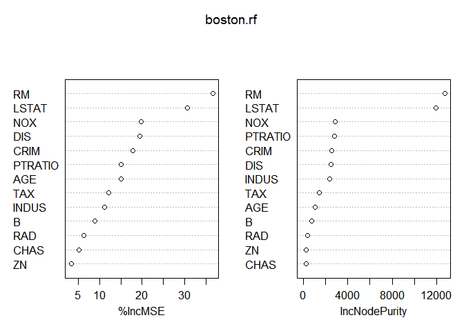
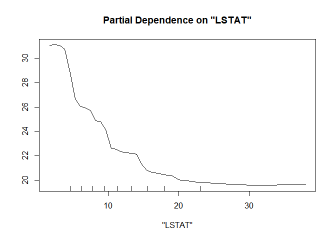
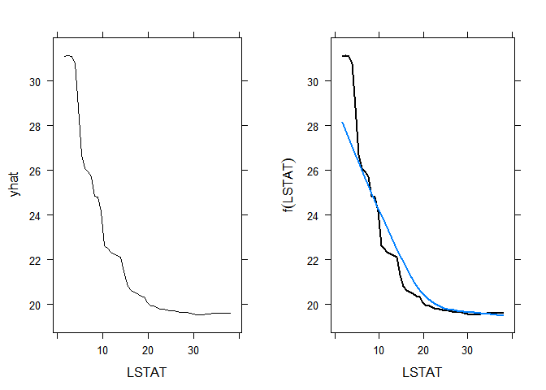
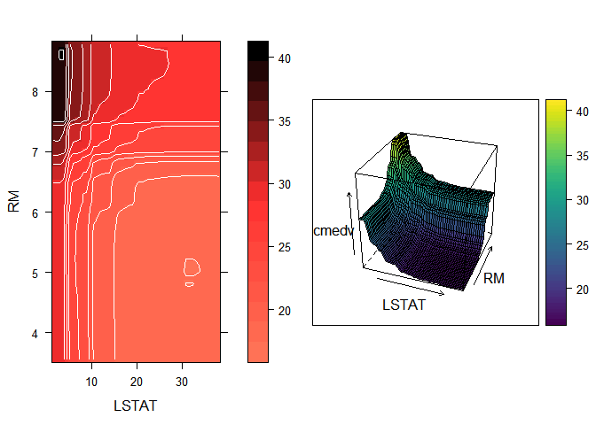

Boston Housing Data
================

Boston Housing Partial Dependence Plot
--------------------------------------

First, get dataset.

``` r
library("pdp")
```

    ## Warning: package 'pdp' was built under R version 3.4.4

``` r
boston <- read.csv("C://Users//user//Desktop//다변량//BostonHousing.csv")
colnames(boston) <- c("CRIM", "ZN","INDUS", "CHAS","NOX", "RM",
                      "AGE", "DIS", "RAD", "TAX", "PTRATIO", "B", "LSTAT", "MEDV")
```

Response Variable: MEDV

Data violate many assumptions(linearity, normality, constant variance)

Simple linear regression(Harrison and Rubinfeld(1978))
======================================================

``` r
boston$B <- boston$B-0.63
attach(boston)
lm_boston <- lm(log(MEDV) ~ RM^2+AGE+log(DIS)+log(RAD)+TAX+PTRATIO+B^2+log(LSTAT)+CRIM+ZN+INDUS+CHAS+NOX^2)
summary(lm_boston) #R-squared: 0.8035
```

    ## 
    ## Call:
    ## lm(formula = log(MEDV) ~ RM^2 + AGE + log(DIS) + log(RAD) + TAX + 
    ##     PTRATIO + B^2 + log(LSTAT) + CRIM + ZN + INDUS + CHAS + NOX^2)
    ## 
    ## Residuals:
    ##      Min       1Q   Median       3Q      Max 
    ## -0.71464 -0.09573 -0.00804  0.10548  0.78105 
    ## 
    ## Coefficients:
    ##               Estimate Std. Error t value Pr(>|t|)    
    ## (Intercept)  4.640e+00  2.095e-01  22.151  < 2e-16 ***
    ## RM           7.296e-02  1.677e-02   4.351 1.65e-05 ***
    ## AGE          3.156e-04  5.320e-04   0.593 0.553254    
    ## log(DIS)    -2.057e-01  3.427e-02  -6.004 3.75e-09 ***
    ## log(RAD)     9.956e-02  1.928e-02   5.164 3.51e-07 ***
    ## TAX         -4.182e-04  1.235e-04  -3.386 0.000767 ***
    ## PTRATIO     -3.087e-02  4.992e-03  -6.183 1.32e-09 ***
    ## B            3.623e-04  1.038e-04   3.492 0.000523 ***
    ## log(LSTAT)  -3.820e-01  2.486e-02 -15.367  < 2e-16 ***
    ## CRIM        -1.187e-02  1.253e-03  -9.471  < 2e-16 ***
    ## ZN          -2.508e-05  5.088e-04  -0.049 0.960709    
    ## INDUS        1.385e-05  2.378e-03   0.006 0.995355    
    ## CHAS         8.876e-02  3.337e-02   2.659 0.008083 ** 
    ## NOX         -8.520e-01  1.532e-01  -5.562 4.37e-08 ***
    ## ---
    ## Signif. codes:  0 '***' 0.001 '**' 0.01 '*' 0.05 '.' 0.1 ' ' 1
    ## 
    ## Residual standard error: 0.1836 on 492 degrees of freedom
    ## Multiple R-squared:  0.8035, Adjusted R-squared:  0.7983 
    ## F-statistic: 154.8 on 13 and 492 DF,  p-value: < 2.2e-16

``` r
detach(boston)
```

PDPs are useful for visualizing the relationships discovered by complex machine learning algorithms

Two most important functions exported by pdp are: "partial", "plotPartial"

development ver: <https://github.com/bgreenwell/pdp>

supported models include:: Decision tree, Bagged decision trees, Boosted decision trees, Linear model, Multivariate adaptive regression splines, Random forest, Support vector machine , ...

Random Forest
-------------

``` r
library(randomForest)
```

    ## Warning: package 'randomForest' was built under R version 3.4.4

    ## randomForest 4.6-14

    ## Type rfNews() to see new features/changes/bug fixes.

``` r
set.seed(101) # for reproducibility
boston.rf <- randomForest(MEDV ~ ., data = boston, importance = TRUE)
boston.rf
```

    ## 
    ## Call:
    ##  randomForest(formula = MEDV ~ ., data = boston, importance = TRUE) 
    ##                Type of random forest: regression
    ##                      Number of trees: 500
    ## No. of variables tried at each split: 4
    ## 
    ##           Mean of squared residuals: 9.912249
    ##                     % Var explained: 88.26

``` r
varImpPlot(boston.rf) # Importance scores
```



percentage of lower status of the population(LSTAT) and average number of rooms per dwelling(RM) are highly associated with MEDV. Drawing partial dependence plot of MEDV on LSTAT, RM might help understanding nature of these associations.

``` r
partialPlot(boston.rf, pred.data = boston, x.var = "LSTAT")
```



``` r
#partial plot uses lattice graphic, so use print.lattice function
library("UsingR")
```

    ## Warning: package 'UsingR' was built under R version 3.4.4

    ## Loading required package: MASS

    ## Loading required package: HistData

    ## Warning: package 'HistData' was built under R version 3.4.4

    ## Loading required package: Hmisc

    ## Warning: package 'Hmisc' was built under R version 3.4.4

    ## Loading required package: lattice

    ## Loading required package: survival

    ## Warning: package 'survival' was built under R version 3.4.4

    ## Loading required package: Formula

    ## Warning: package 'Formula' was built under R version 3.4.4

    ## Loading required package: ggplot2

    ## 
    ## Attaching package: 'ggplot2'

    ## The following object is masked from 'package:randomForest':
    ## 
    ##     margin

    ## 
    ## Attaching package: 'Hmisc'

    ## The following objects are masked from 'package:base':
    ## 
    ##     format.pval, units

    ## 
    ## Attaching package: 'UsingR'

    ## The following object is masked from 'package:survival':
    ## 
    ##     cancer

``` r
par(mfrow=c(1,2))
# Left: default plot based on Random Forest
print(partial(boston.rf, pred.var = "LSTAT", plot = TRUE), position = c(0, 0, 0.5, 1), more = TRUE)
# Right: adds LOESS smooth
print(boston.rf %>% partial(pred.var = "LSTAT") %>%
  plotPartial(smooth = TRUE, lwd = 2, ylab = expression(f(LSTAT))), position = c(0.5, 0, 1, 1))
```



``` r
# Compute partial dependence data for LSTAT and RM
pd <- partial(boston.rf, pred.var = c("LSTAT", "RM"))

# Add contour lines and use a different color palette
col <- colorRampPalette(c("coral1", "firebrick1", "gray0"))
boston_contour <- plotPartial(pd, contour = TRUE, col.regions = col)

# 3-D surface
boston_3d <- plotPartial(pd, levelplot = FALSE, zlab = "cmedv", drape = TRUE,
                    colorkey = TRUE, screen = list(z = -20, x = -60))
# Contour lines
grid.arrange(boston_contour, boston_3d, ncol = 2)
```


